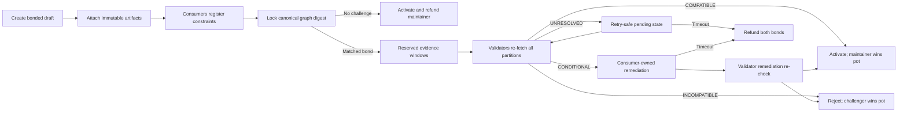

# ArtifactCourt

**Consensus-backed release integrity, compatibility adjudication, and bonded remediation on GenLayer.**

ArtifactCourt turns a software release candidate into an auditable on-chain case. A maintainer binds a full Git commit, immutable artifact URLs, declared SHA-256 digests, and consumer-owned compatibility constraints. A challenger can match the maintainer's bond and submit counter-evidence. GenLayer validators then re-fetch every evidence partition and produce a verdict that directly controls activation, remediation ownership, rejection, or refunds.

> ArtifactCourt does not claim that software is bug-free. It decides whether one exact release revision satisfies one exact locked dependency graph under public evidence available at adjudication time.

## Live release

| Surface | Value |
| --- | --- |
| Application | Deployment pending |
| Network | GenLayer Bradbury testnet |
| Contract | [`0x9AFE...489c`](https://explorer-bradbury.genlayer.com/address/0x9AFEc9731370e4A14a48a450B8408b13f702489c) |
| Deployment transaction | [`0x98ff...1d60`](https://explorer-bradbury.genlayer.com/tx/0x98ff08178a528f37d6c2305baf6d76e7cc02a78b143d959106d6424c00021d60) |
| Chain | `testnet-bradbury` |

Bradbury GEN is faucet-issued test currency with no promised monetary value.

## Why GenLayer is essential

A deterministic contract can compare hashes, enforce deadlines, and account for bonds, but it cannot determine whether an API migration, schema change, binary, or adapter actually satisfies prose compatibility constraints spread across public sources. ArtifactCourt uses GenLayer-native non-deterministic execution for that consequential decision:

1. `gl.nondet.web.render(...)` independently re-fetches maintainer evidence, challenger evidence, and consumer constraints.
2. Each side receives a separate 7,000-character budget; one party cannot crowd the other out of validator context.
3. `gl.nondet.exec_prompt(...)` returns a strict compatibility verdict schema.
4. `gl.vm.run_nondet_unsafe(...)` requires validators to independently reproduce the verdict and affected consumer.
5. The agreed result changes contract state and settles matched bonds.

The React app calls the deployed contract through `genlayer-js`, waits for an `ACCEPTED` transaction receipt, and re-reads authoritative state after every write.

## Workflow



## State machine

| State | Meaning | Allowed next states |
| --- | --- | --- |
| `DRAFT` | Maintainer and consumers build the evidence graph | `LOCKED`, `CANCELLED` |
| `LOCKED` | Graph digest is immutable; challenge window is open | `CHALLENGED`, `ACTIVATED` |
| `CHALLENGED` | Equal bonds are locked; each party owns a reserved evidence partition | `ACTIVATED`, `REJECTED`, `CONDITIONAL`, `UNRESOLVED`, `REFUNDED` |
| `UNRESOLVED` | Evidence was unavailable, contradictory, or insufficient | retry adjudication, `REFUNDED` |
| `CONDITIONAL` | One registered consumer owns a concrete remediation gate | `ACTIVATED`, `REJECTED`, `REFUNDED` |
| `ACTIVATED` | Compatible or unchallenged release; accounting closed | terminal |
| `REJECTED` | Incompatible release; accounting closed | terminal |
| `REFUNDED` | Consensus/remediation timed out; principals returned | terminal |
| `CANCELLED` | Maintainer cancelled an unlocked draft | terminal |

## Contract invariants

- **Immutable provenance:** revision URLs require a full 40-character Git commit; artifact URLs must contain the same revision.
- **Canonical evidence graph:** artifact declarations and sorted consumer constraints are committed to a SHA-256 graph digest.
- **Consumer ownership:** each constraint is bound to the wallet that registered it.
- **Symmetric exposure:** challenger bond must exactly equal the maintainer bond.
- **Balanced context:** maintainer and challenger have independent evidence budgets.
- **Fresh evidence:** validators fetch sources during adjudication and remediation verification.
- **Fail-closed uncertainty:** required fetch failure produces `UNRESOLVED`, not a guessed winner.
- **Consumer-owned remediation:** only the affected consumer wallet can approve a conditional fix.
- **Pull-safe finality:** terminal settlement zeroes stored liabilities before emitting transfers.
- **Liveness:** unresolved or conditional cases refund both principals after a fixed timeout.

## Project structure

```text
artifact-court/
|-- contracts/
|   `-- artifact_court.py       # Intelligent Contract and settlement state machine
|-- deployments/
|   `-- bradbury.json           # Machine-readable production release record
|-- docs/
|   |-- ARCHITECTURE.md         # Trust boundaries and adjudication design
|   |-- DEPLOYMENT.md           # Reproducible deployment procedure
|   `-- JUDGE-WALKTHROUGH.md    # Reviewer verification path
|-- scripts/
|   `-- verify-project.mjs      # Contract/client binding verification
|-- src/
|   |-- lib/genlayer.ts         # Bradbury read/write clients and receipts
|   |-- App.tsx                 # Public docket and complete transaction workflow
|   |-- styles.css              # Responsive ArtifactCourt visual system
|   `-- types.ts                # Authoritative frontend read model
|-- tests/
|   |-- project-integration.test.mjs
|   `-- test_contract_behavior.py
|-- SECURITY.md
|-- package.json
`-- vercel.json
```

## Public contract methods

### Writes

`create_release`, `add_artifact`, `register_consumer`, `lock_release`, `cancel_draft`, `open_challenge`, `submit_evidence`, `adjudicate`, `submit_remediation`, `approve_remediation`, `verify_remediation`, `activate_unchallenged`, `refund_timed_out`

### Views

`get_case`, `get_artifact`, `get_dependency`, `list_case_ids`, `get_policy`

## Local verification

```bash
npm ci
npm test
npm run verify
npm run build
python -m py_compile contracts/artifact_court.py
python -m genvm_linter.cli check contracts/artifact_court.py
```

Current regression coverage includes full-commit binding, graph determinism, balanced evidence budgets, matched bonds, winner-controlled settlement, consumer remediation authority, timeout refunds, frontend reads/writes, receipt confirmation, and GenLayer consensus primitives.

## Local development

```bash
cp .env.example .env.local
npm run dev
```

Set `VITE_ARTIFACT_COURT_ADDRESS` to the deployed Bradbury contract. No private key or deployment token belongs in browser environment variables.

## Judge walkthrough

1. Open the public docket and connect a Bradbury-compatible wallet.
2. Create a release with a full GitHub commit URL and test GEN bond.
3. Add at least one artifact URL containing that exact commit and a `sha256:` digest.
4. From a consumer wallet, register a public compatibility constraint.
5. Lock the graph, then open a challenge from a different wallet with the displayed matching bond.
6. Submit public evidence from both bonded wallets.
7. After the evidence deadline, call adjudication and inspect the accepted transaction plus stored verdict.
8. For a conditional verdict, verify that only the affected consumer wallet can approve remediation.
9. For unresolved evidence, retry before timeout or refund both principals after timeout.

See [docs/JUDGE-WALKTHROUGH.md](docs/JUDGE-WALKTHROUGH.md) for code-level evidence.

## Acknowledgements

ArtifactCourt is an original implementation informed by public GenLayer patterns for validator-fetched market settlement, immutable compatibility graphs, retry-safe unresolved verdicts, artifact provenance, and regression-focused release discipline. No reference project is used as a runtime dependency.

## License

MIT. See [LICENSE](LICENSE).
