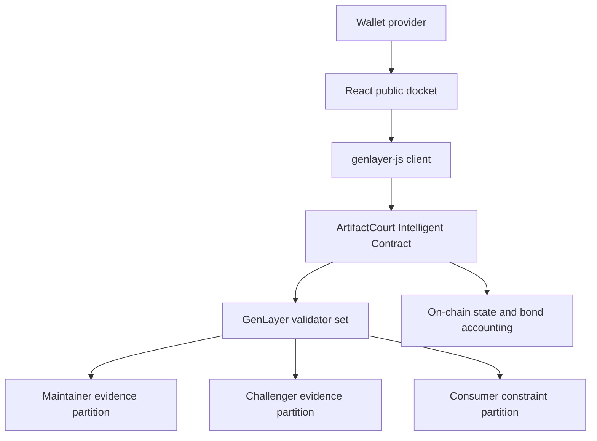

# Architecture

## Components



The frontend is intentionally untrusted. It formats transactions and presents state, but every role check, deadline, graph lock, verdict transition, and settlement invariant is enforced by the contract.

## Evidence partitions

Maintainer and challenger evidence each receive exactly 7,000 rendered characters. Every evidence item carries a declared SHA-256 content digest; validators verify fetched bytes match each declared digest and fail closed on any mismatch. Constraints receive a separate 5,000-character pool distributed across registered consumers. Unused capacity from one party is never transferred to the other. Immutable artifacts are fetched separately as raw bytes and compared against their locked SHA-256 declarations before semantic adjudication begins.

Validators invoke the same fetch-and-assess function independently. Agreement is required on both `verdict` and `affected_consumer_id`; prose reasoning must also be non-empty and bounded. Before conditional settlement can proceed, validators independently reproduce the exact remediation requirement from content-bound evidence and confirm it matches the stored value.

## Verdict schema

```json
{
  "verdict": "COMPATIBLE|CONDITIONAL|INCOMPATIBLE|UNRESOLVED",
  "affected_consumer_id": "registered id or empty",
  "reasoning": "source-grounded explanation",
  "remediation": "specific bounded action or empty"
}
```

Cross-field validation rejects conditional verdicts without a registered consumer or concrete remediation. Non-conditional verdicts cannot smuggle remediation ownership into state.

## Settlement policy

- `COMPATIBLE`: maintainer receives both equal bonds.
- `INCOMPATIBLE`: challenger receives both equal bonds.
- `CONDITIONAL`: bonds remain locked while the affected consumer controls approval.
- successful remediation: maintainer receives both bonds.
- failed remediation: challenger receives both bonds.
- `UNRESOLVED` or conditional timeout: each party receives its original principal.
- no challenge: release activates and maintainer bond is returned.

Bond values are set to zero and the case is marked settled before any external transfer is emitted.

## Liveness and failure

Transport failures, empty public pages, oversized artifacts, contradictory evidence, evidence digest mismatches, and insufficient constraint coverage fail closed. They do not create an incompatible verdict and do not reward either party. A remediation fetch failure also preserves `CONDITIONAL` rather than treating unavailable evidence as a failed fix. A remediation requirement reproduction mismatch (where validators derive a different requirement from the content-bound evidence) also preserves `CONDITIONAL`. Adjudication remains retryable until the fixed resolution timeout, after which either bonded party can return both principals.
